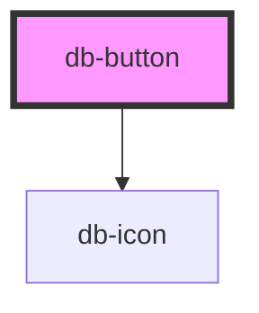

# API Docs

## Style Dependencies

Add the following styles to your application. If you have added the base dependencies already for another component, don't do again.

- replace {path} with your path to copied css 
- replace {theme} with one of [enterprise,fernverkehr]

```css
// base dependencies (required)
@import url({path}/themes/{theme}/css/00-base/colors/colors.vars.css);
@import url({path}/themes/{theme}/css/00-base/type/fonts.css);

// component style (required)
@import url({path}/themes/{theme}/css/01-elements/buttons/button.vars.css);

// if icons used
@import url({path}/themes/{theme}/css/00-base/icons/icons.action.css);
@import url({path}/themes/{theme}/css/00-base/icons/icons.av.css);
@import url({path}/themes/{theme}/css/00-base/icons/icons.communication.css);
@import url({path}/themes/{theme}/css/00-base/icons/icons.covid-19.css);
@import url({path}/themes/{theme}/css/00-base/icons/icons.facilities.css);
@import url({path}/themes/{theme}/css/00-base/icons/icons.feature.css);
@import url({path}/themes/{theme}/css/00-base/icons/icons.food.css);
@import url({path}/themes/{theme}/css/00-base/icons/icons.journey.css);
@import url({path}/themes/{theme}/css/00-base/icons/icons.maps.css);
@import url({path}/themes/{theme}/css/00-base/icons/icons.navigation.css);
@import url({path}/themes/{theme}/css/00-base/icons/icons.notification.css);
@import url({path}/themes/{theme}/css/00-base/icons/icons.seat.css);
@import url({path}/themes/{theme}/css/00-base/icons/icons.ticket.css);
@import url({path}/themes/{theme}/css/00-base/icons/icons.transportation.css);
@import url({path}/themes/{theme}/css/00-base/icons/missing-icons.css);
```

<!-- Auto Generated Below -->


## Properties

| Property         | Attribute        | Description                                                                                                                                                                                                           | Type                                                                                           | Default     |
| ---------------- | ---------------- | --------------------------------------------------------------------------------------------------------------------------------------------------------------------------------------------------------------------- | ---------------------------------------------------------------------------------------------- | ----------- |
| `ariaexpanded`   | `ariaexpanded`   | If the button controls a grouping of other elements, the ariaexpanded state indicates whether the controlled grouping is currently expanded or collapsed.                                                             | `"false" \| "true"`                                                                            | `null`      |
| `ariapressed`    | `ariapressed`    | Defines the button as a toggle button. The value of aria-pressed describes the state of the button.                                                                                                                   | `"false" \| "true"`                                                                            | `null`      |
| `disabled`       | `disabled`       | The disabled attribute can be set to keep a user from clicking on the button.                                                                                                                                         | `boolean`                                                                                      | `false`     |
| `formaction`     | `formaction`     | The formaction attribute specifies where to send the form-data when a form is submitted. Only for type="submit".                                                                                                      | `string`                                                                                       | `undefined` |
| `formenctype`    | `formenctype`    | The formenctype attribute specifies how form-data should be encoded before sending it to a server. Only for type="submit".                                                                                            | `string`                                                                                       | `undefined` |
| `formmethod`     | `formmethod`     | The formmethod attribute specifies how to send the form-data (which HTTP method to use). Only for type="submit".                                                                                                      | `"get" \| "post"`                                                                              | `undefined` |
| `formnovalidate` | `formnovalidate` | The formnovalidate attribute specifies which that the form-data should not be validated on submission. Only for type="submit".                                                                                        | `boolean`                                                                                      | `false`     |
| `formtarget`     | `formtarget`     | The formtarget attribute specifies where to display the response after submitting the form. Only for type="submit".                                                                                                   | `"_blank" \| "_parent" \| "_self" \| "_top"`                                                   | `undefined` |
| `icon`           | `icon`           | Define an icon by it's identifier (like e.g. _download_, compare to [DB UI Icons](https://db-ui.github.io/core/patterns/base-icons/index.html)) to get displayed in front of the elements content. | `string`                                                                                       | `undefined` |
| `iconafter`      | `iconafter`      | Define an icon by it's identifier (like e.g. _download_, compare to [DB UI Icons](https://db-ui.github.io/core/patterns/base-icons/index.html)) to get displayed behind the elements content.      | `string`                                                                                       | `undefined` |
| `icononly`       | `icononly`       | Define the text next to the icon specified via the icon Property to get hidden.                                                                                                                                       | `boolean`                                                                                      | `undefined` |
| `name`           | `name`           | The name attribute specifies a name for the button.                                                                                                                                                                   | `string`                                                                                       | `undefined` |
| `tooltip`        | `tooltip`        | The tooltip attribute specifies the title of button.                                                                                                                                                                  | `string`                                                                                       | `undefined` |
| `type`           | `type`           | The type attribute specifies the type of button.                                                                                                                                                                      | `"button" \| "reset" \| "submit"`                                                              | `'submit'`  |
| `value`          | `value`          | The value attribute specifies an initial value for the button.                                                                                                                                                        | `string`                                                                                       | `undefined` |
| `variant`        | `variant`        | The variant attribute specifies a visual expression of button.                                                                                                                                                        | `"brand-primary" \| "primary" \| "secondary-outline" \| "secondary-solid" \| "tertiary-plain"` | `undefined` |


## Dependencies

### Depends on

- [db-icon](../db-icon)

### Graph


----------------------------------------------

*Built with [StencilJS](https://stenciljs.com/)*
