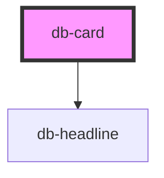

# db-card

<!-- Auto Generated Below -->

## Properties

| Property                 | Attribute           | Description                                                                                                                            | Type                                                                                                                                                                                                                                                                                                                                                                                                                                                                                                                                                                                                                                                                                                                                                                                                                                                                                                                                                                                                                                                                                                                                                                                                                                                                                                                                                                                                                                                                              | Default                  |
| ------------------------ | ------------------- | -------------------------------------------------------------------------------------------------------------------------------------- | --------------------------------------------------------------------------------------------------------------------------------------------------------------------------------------------------------------------------------------------------------------------------------------------------------------------------------------------------------------------------------------------------------------------------------------------------------------------------------------------------------------------------------------------------------------------------------------------------------------------------------------------------------------------------------------------------------------------------------------------------------------------------------------------------------------------------------------------------------------------------------------------------------------------------------------------------------------------------------------------------------------------------------------------------------------------------------------------------------------------------------------------------------------------------------------------------------------------------------------------------------------------------------------------------------------------------------------------------------------------------------------------------------------------------------------------------------------------------------- | ------------------------ |
| `alt`                    | `alt`               | The alt attribute for the image.                                                                                                       | `string`                                                                                                                                                                                                                                                                                                                                                                                                                                                                                                                                                                                                                                                                                                                                                                                                                                                                                                                                                                                                                                                                                                                                                                                                                                                                                                                                                                                                                                                                          | `undefined`              |
| `content`                | `content`           | The content represents the content of the card. It's optional and you can use slot for custom tags.                                    | `string`                                                                                                                                                                                                                                                                                                                                                                                                                                                                                                                                                                                                                                                                                                                                                                                                                                                                                                                                                                                                                                                                                                                                                                                                                                                                                                                                                                                                                                                                          | `undefined`              |
| `header`                 | `header`            | The header represents the title of the card. It's optional and you can use slot for custom tags.                                       | `string`                                                                                                                                                                                                                                                                                                                                                                                                                                                                                                                                                                                                                                                                                                                                                                                                                                                                                                                                                                                                                                                                                                                                                                                                                                                                                                                                                                                                                                                                          | `undefined`              |
| `illustration`           | `illustration`      | The illustration which will show a predefined svg. -Development: enum can be generated with /scripts/illustration-generator-           | `"location" \| "error" \| "calendar" \| "compass" \| "heart" \| "search" \| "chat" \| "wifi" \| "mask" \| "buggy" \| "coffee-cup" \| "restaurant" \| "home" \| "timetable" \| "bicycle" \| "car" \| "local-train" \| "alarm-clock" \| "blizzard" \| "broken" \| "bus" \| "christmas" \| "clock-moving" \| "construction-sign" \| "construction-worker" \| "customer-feedback" \| "db-clock" \| "db-comfort-checkin" \| "db-ticket-shop" \| "db-ticket-vending-machine" \| "db-trainstation-with-train" \| "db-trainstation" \| "db-travel-center" \| "db-video-travel-center" \| "delayed" \| "der-kleine-ice" \| "diamond" \| "disruptions" \| "distance" \| "ffp2-mask-with-sign" \| "ffp2-mask" \| "fokus" \| "gaming-no-wire" \| "gaming" \| "green-energy" \| "green" \| "handshake" \| "handwashing" \| "hashtag" \| "information" \| "itinerary" \| "kiosk" \| "laptop" \| "lost-and-found" \| "luggage" \| "mini-store" \| "mobileticket-brand" \| "mobileticket-feature" \| "movie" \| "news" \| "newsletter" \| "newspaper" \| "no-handshaking" \| "onlineshop-brand" \| "onlineshop-feature" \| "onlineticket-brand" \| "onlineticket-feature" \| "passenger-rights" \| "podcast" \| "poi-berlin-copy" \| "poi-berlin" \| "savings" \| "scan-ticket-printout" \| "self-driving" \| "show-ticket" \| "single-entry" \| "smartphone" \| "sport" \| "suitcase" \| "tablet" \| "thunderstorm" \| "tickets" \| "tips" \| "transportation-advertising" \| "whats-schmutzig"` | `undefined`              |
| `image`                  | `image`             | The prop image can be used instead of illustration to show a custom img.                                                               | `string`                                                                                                                                                                                                                                                                                                                                                                                                                                                                                                                                                                                                                                                                                                                                                                                                                                                                                                                                                                                                                                                                                                                                                                                                                                                                                                                                                                                                                                                                          | `undefined`              |
| `uiCoreIllustrationPath` | `illustration-path` | The illustration-path defines the path to DB UI Core illustrations. If you want to use other/custom images use the image prop instead. | `string`                                                                                                                                                                                                                                                                                                                                                                                                                                                                                                                                                                                                                                                                                                                                                                                                                                                                                                                                                                                                                                                                                                                                                                                                                                                                                                                                                                                                                                                                          | `'./icons/illustrative'` |
| `variant`                | `variant`           | The variant which is banner or title.                                                                                                  | `"banner" \| "title"`                                                                                                                                                                                                                                                                                                                                                                                                                                                                                                                                                                                                                                                                                                                                                                                                                                                                                                                                                                                                                                                                                                                                                                                                                                                                                                                                                                                                                                                             | `'banner'`               |

## Dependencies

### Depends on

- [db-headline](../db-headline)

### Graph

----------------------------------------------

*Built with [StencilJS](https://stenciljs.com/)*
