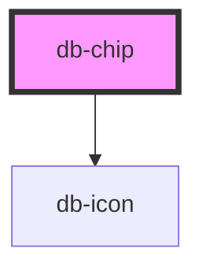

# db-chip

<!-- Auto Generated Below -->

## Properties

| Property          | Attribute         | Description                                                                                                                                                                                                                                           | Type                                                                                                                                                                                                                                                                                                           | Default            |
| ----------------- | ----------------- | ----------------------------------------------------------------------------------------------------------------------------------------------------------------------------------------------------------------------------------------------------- | -------------------------------------------------------------------------------------------------------------------------------------------------------------------------------------------------------------------------------------------------------------------------------------------------------------- | ------------------ |
| `disabled`        | `disabled`        | The disabled attribute can be set to keep a user from clicking on the chip.                                                                                                                                                                           | `boolean`                                                                                                                                                                                                                                                                                                      | `false`            |
| `icon`            | `icon`            | Attribute to add icon before chip.                                                                                                                                                                                                                    | `string`                                                                                                                                                                                                                                                                                                       | `undefined`        |
| `iconafter`       | `iconafter`       | Attribute to add icon after chip.                                                                                                                                                                                                                     | `string`                                                                                                                                                                                                                                                                                                       | `undefined`        |
| `input_id`        | `input_id`        | The input_id of a label form-related element in the same document as the label element. The first element in the document with an id matching the value of the for attribute is the labeled control for this label element, if it is a label element. | `string`                                                                                                                                                                                                                                                                                                       | `'chip-' + uuid()` |
| `interactiontype` | `interactiontype` | Decides which interactiontype you want to use: filter (1-n); selection (1);                                                                                                                                                                           | `"filter" \| "selection"`                                                                                                                                                                                                                                                                                      | `'selection'`      |
| `name`            | `name`            | Name to group multiple chips.                                                                                                                                                                                                                         | `string`                                                                                                                                                                                                                                                                                                       | `'chips'`          |
| `selected`        | `selected`        | Selected state                                                                                                                                                                                                                                        | `boolean`                                                                                                                                                                                                                                                                                                      | `false`            |
| `variant`         | `variant`         | Predefined variants to change background color and font color.                                                                                                                                                                                        | `"error" \| "informative" \| "poi-db-services-einrichtung" \| "poi-dienstleistungen" \| "poi-einkaufen" \| "poi-essen-trinken" \| "poi-freizeit" \| "poi-gesundheit" \| "poi-kunst-kultur" \| "poi-wegeleitung" \| "poi-wissenswertes" \| "poi-zivile-rel-einrichtungen" \| "success" \| "track" \| "warning"` | `undefined`        |

## Dependencies

### Depends on

- [db-icon](../db-icon)

### Graph

----------------------------------------------

*Built with [StencilJS](https://stenciljs.com/)*
