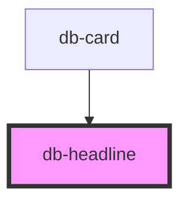

# db-headline

{/* Auto Generated Below */}

## Properties

| Property  | Attribute | Description                                                                      | Type                                     | Default |
| --------- | --------- | -------------------------------------------------------------------------------- | ---------------------------------------- | ------- |
| `pulse`   | `pulse`   | The pulse attribute determines whether to add a visual DB Pulse to the headline. | `boolean`                                | `false` |
| `variant` | `variant` | The variant attribute specifies the size of the headline.                        | `"1" \| "2" \| "3" \| "4" \| "5" \| "6"` | `'3'`   |

## Dependencies

### Used by

 - [db-card](../db-card)

### Graph

----------------------------------------------

*Built with [StencilJS](https://stenciljs.com/)*
