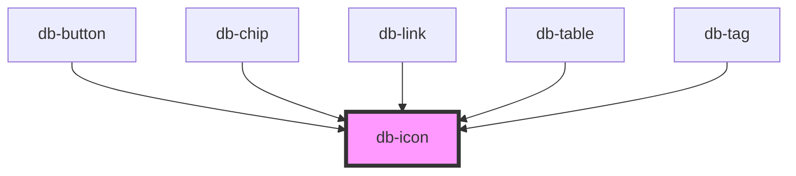

# db-icon

<!-- Auto Generated Below -->

## Properties

| Property            | Attribute | Description                                                    | Type                                                                                                                                                                      | Default     |
| ------------------- | --------- | -------------------------------------------------------------- | ------------------------------------------------------------------------------------------------------------------------------------------------------------------------- | ----------- |
| `icon` _(required)_ | `icon`    | The icon attribute specifies the icon to use.                  | `string`                                                                                                                                                                  | `undefined` |
| `variant`           | `variant` | The variant attribute specifies the style and size of an icon. | `"16-outline" \| "20-filled" \| "20-outline" \| "24-filled" \| "24-outline" \| "32-filled" \| "32-outline" \| "48-filled" \| "48-outline" \| "64-filled" \| "64-outline"` | `undefined` |

## Dependencies

### Used by

 - [db-button](../db-button)
 - [db-chip](../db-chip)
 - [db-link](../db-link)
 - [db-table](../db-table)
 - [db-tag](../db-tag)

### Graph

----------------------------------------------

*Built with [StencilJS](https://stenciljs.com/)*
