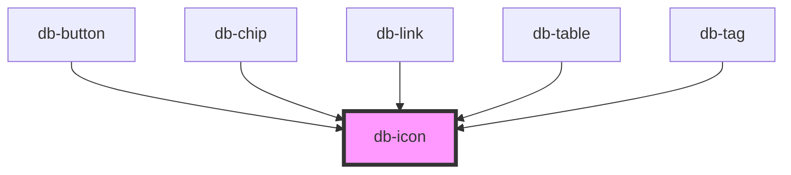

# db-icon

{/* ## Style Dependencies

Add the following styles to your application.

- replace {path} with your path to copied css
- replace {theme} with one of [enterprise,fernverkehr]

```css
@import url({path}/themes/{theme}/css/00-base/icons/icons.action.css);
@import url({path}/themes/{theme}/css/00-base/icons/icons.av.css);
@import url({path}/themes/{theme}/css/00-base/icons/icons.communication.css);
@import url({path}/themes/{theme}/css/00-base/icons/icons.covid-19.css);
@import url({path}/themes/{theme}/css/00-base/icons/icons.facilities.css);
@import url({path}/themes/{theme}/css/00-base/icons/icons.feature.css);
@import url({path}/themes/{theme}/css/00-base/icons/icons.food.css);
@import url({path}/themes/{theme}/css/00-base/icons/icons.journey.css);
@import url({path}/themes/{theme}/css/00-base/icons/icons.maps.css);
@import url({path}/themes/{theme}/css/00-base/icons/icons.navigation.css);
@import url({path}/themes/{theme}/css/00-base/icons/icons.notification.css);
@import url({path}/themes/{theme}/css/00-base/icons/icons.seat.css);
@import url({path}/themes/{theme}/css/00-base/icons/icons.ticket.css);
@import url({path}/themes/{theme}/css/00-base/icons/icons.transportation.css);
@import url({path}/themes/{theme}/css/00-base/icons/missing-icons.css);
```
*/}

{/* Auto Generated Below */}


## Properties

| Property            | Attribute | Description                                                    | Type                                                                                                                                                                                     | Default     |
| ------------------- | --------- | -------------------------------------------------------------- | ---------------------------------------------------------------------------------------------------------------------------------------------------------------------------------------- | ----------- |
| `icon` _(required)_ | `icon`    | The icon attribute specifies the icon to use.                  | `string`                                                                                                                                                                                 | `undefined` |
| `variant`           | `variant` | The variant attribute specifies the style and size of an icon. | `"16-filled" \| "16-outline" \| "20-filled" \| "20-outline" \| "24-filled" \| "24-outline" \| "32-filled" \| "32-outline" \| "48-filled" \| "48-outline" \| "64-filled" \| "64-outline"` | `undefined` |


## Dependencies

### Used by

 - [db-button](../db-button)
 - [db-chip](../db-chip)
 - [db-link](../db-link)
 - [db-table](../db-table)
 - [db-tag](../db-tag)

### Graph


----------------------------------------------

*Built with [StencilJS](https://stenciljs.com/)*
