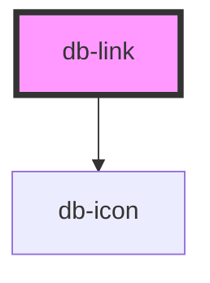

# db-link

<!-- Auto Generated Below -->

## Properties

| Property      | Attribute      | Description                                                                                                                                                                                                                                                                                                 | Type                                                                                                                                                                                                                                                                                       | Default        |
| ------------- | -------------- | ----------------------------------------------------------------------------------------------------------------------------------------------------------------------------------------------------------------------------------------------------------------------------------------------------------- | ------------------------------------------------------------------------------------------------------------------------------------------------------------------------------------------------------------------------------------------------------------------------------------------ | -------------- |
| `current`     | `current`      | The current attribute is the state on an element indicates that this element represents the current item within a container or set of related elements.                                                                                                                                                     | `"date" \| "false" \| "location" \| "page" \| "step" \| "time" \| "true"`                                                                                                                                                                                                                  | `undefined`    |
| `href`        | `href`         | The href attribute represents a hyperlink (a hypertext anchor).                                                                                                                                                                                                                                             | `string`                                                                                                                                                                                                                                                                                   | `undefined`    |
| `hreflang`    | `hreflang`     | The hreflang attribute gives the language of the linked resource. The value must be a valid BCP 47 language tag.                                                                                                                                                                                            | `string`                                                                                                                                                                                                                                                                                   | `undefined`    |
| `icon`        | `icon`         | Define an icon by it's identifier (like e.g. _download_, compare to [DB UI Icons](https://db-ui.github.io/core/patterns/base-icons/index.html)) to get displayed in front of the elements content.                                                                                                          | `string`                                                                                                                                                                                                                                                                                   | `undefined`    |
| `iconVariant` | `icon-variant` | The variant attribute specifies the style and size of an icon.                                                                                                                                                                                                                                              | `"16-filled" \| "16-outline" \| "20-filled" \| "20-outline" \| "24-filled" \| "24-outline" \| "32-filled" \| "32-outline" \| "48-filled" \| "48-outline" \| "64-filled" \| "64-outline"`                                                                                                   | `'24-outline'` |
| `icononly`    | `icononly`     | Define the text next to the icon specified via the icon Property to get hidden.                                                                                                                                                                                                                             | `boolean`                                                                                                                                                                                                                                                                                  | `undefined`    |
| `media`       | `media`        | The media attribute describes for which media the target document was designed. The value must be a valid media query. The default, if the media attribute is omitted, is "all".                                                                                                                            | `string`                                                                                                                                                                                                                                                                                   | `undefined`    |
| `rel`         | `rel`          | The rel attribute controls what kinds of links the elements create. The attribue's value must be a set of space-separated tokens. The allowed keywords and their meanings are defined below.                                                                                                                | `"section" \| "start" \| "help" \| "search" \| "contents" \| "prefetch" \| "bookmark" \| "copyright" \| "alternate" \| "appendix" \| "author" \| "chapter" \| "glossary" \| "index" \| "license" \| "next" \| "nofollow" \| "noopener" \| "noreferrer" \| "prev" \| "subsection" \| "tag"` | `undefined`    |
| `target`      | `target`       | The target attribute gives the name of the browsing context that will be used. User agents use this name when following hyperlinks.                                                                                                                                                                         | `"_blank" \| "_parent" \| "_self" \| "_top"`                                                                                                                                                                                                                                               | `undefined`    |
| `text`        | `text`         | The text attribute can be used to set the text inside the anchor tag without slot.                                                                                                                                                                                                                          | `string`                                                                                                                                                                                                                                                                                   | `undefined`    |
| `type`        | `type`         | The type attribute, if present, gives the MIME type of the linked resource. The value must be a valid MIME type. User agents must not consider the type attribute authoritative — upon fetching the resource, user agents must not use metadata included in the link to the resource to determine its type. | `string`                                                                                                                                                                                                                                                                                   | `undefined`    |

## Dependencies

### Depends on

- [db-icon](../db-icon)

### Graph

----------------------------------------------

*Built with [StencilJS](https://stenciljs.com/)*
