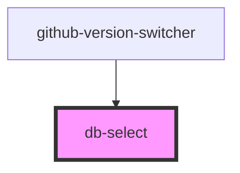

# db-select

<!-- Auto Generated Below -->

## Properties

| Property             | Attribute      | Description                                                                                                                                                                                                                                                                                                                                            | Type                                                   | Default              |
| -------------------- | -------------- | ------------------------------------------------------------------------------------------------------------------------------------------------------------------------------------------------------------------------------------------------------------------------------------------------------------------------------------------------------ | ------------------------------------------------------ | -------------------- |
| `ariainvalid`        | `ariainvalid`  | The ariainvalid attribute is used to indicate that the value entered into an input field does not conform to the format expected by the application.                                                                                                                                                                                                   | `boolean`                                              | `false`              |
| `disabled`           | `disabled`     | The disabled attribute can be set to keep a user from clicking on the select.                                                                                                                                                                                                                                                                          | `boolean`                                              | `false`              |
| `input_id`           | `input_id`     | The input_id of a labelable form-related element in the same document as the label element. The first element in the document with an id matching the value of the for attribute is the labeled control for this label element, if it is a labelable element.                                                                                          | `string`                                               | `'select-' + uuid()` |
| `label` _(required)_ | `label`        | The label attribute specifies the caption of the selectbox.                                                                                                                                                                                                                                                                                            | `string`                                               | `undefined`          |
| `labelHidden`        | `label-hidden` | The label-hidden attribute is a boolean attribute. When specified, the elements label gets visually hidden (it's important to still keep it displayed for accessibility reasons).                                                                                                                                                                      | `string`                                               | `undefined`          |
| `multiple`           | `multiple`     | If the multiple attribute is present, then the select element represents a control for selecting zero or more options from the list of options. If the attribute is absent, then the select element represents a control for selecting a single option from the list of options.                                                                       | `boolean`                                              | `false`              |
| `name` _(required)_  | `name`         | The name attribute gives the name of the form control, as used in form submission and in the form element's elements object. If the attribute is specified, its value must not be the empty string.                                                                                                                                                    | `string`                                               | `undefined`          |
| `required`           | `required`     | When the required attribute specified, the user will be required to select a value before submitting the form.                                                                                                                                                                                                                                         | `boolean`                                              | `false`              |
| `size`               | `size`         | The size attribute gives the number of options to show to the user. The size attribute, if specified, must have a value that is a valid non-negative integer greater than zero. If the multiple attribute is present, then the size attribute's default value is 4. If the multiple attribute is absent, then the size attribute's default value is 1. | `number`                                               | `undefined`          |
| `value`              | `value`        | The value property is to receive results from the native element. Use 'this.value' to process the expected value when onchange is used.                                                                                                                                                                                                                | `string`                                               | `undefined`          |
| `variant`            | `variant`      | The variant attribute specifies a visual expression of a select.                                                                                                                                                                                                                                                                                       | `"outline" \| "semitransparent" \| "solid" \| "white"` | `'semitransparent'`  |

## Events

| Event      | Description                      | Type               |
| ---------- | -------------------------------- | ------------------ |
| `dbChange` | Mapping for default change Event | `CustomEvent<any>` |

## Dependencies

### Used by

 - [github-version-switcher](../development/github-version-switcher)

### Graph

----------------------------------------------

*Built with [StencilJS](https://stenciljs.com/)*
