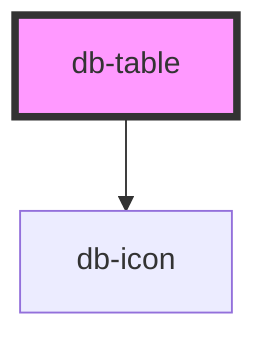

# db-table

{/* Auto Generated Below */}

## Properties

| Property            | Attribute           | Description                                                                                                                                                                            | Type               | Default     |
| ------------------- | ------------------- | -------------------------------------------------------------------------------------------------------------------------------------------------------------------------------------- | ------------------ | ----------- |
| `align`             | `align`             | The align prop sets the data-align attribute on the thead element of the rendered table. Valid values are "left" (default), "center", "bottom"                                         | `string`           | `''`        |
| `bodyalign`         | `bodyalign`         | The bodyalign prop sets the data-align attribute on the tbody element of the rendered table. Valid values are "left" (default), "center", "bottom"                                     | `string`           | `''`        |
| `bodyverticalalign` | `bodyverticalalign` | The bodyverticalalign prop sets the data-vertical-align attribute on the tbody element of the rendered table. Valid values are "top" (default), "middle", "bottom"                     | `string`           | `''`        |
| `border`            | `border`            | The border prop sets the data-border attribute on the table element of the rendered table. Valid values are "around", "horizontal"                                                     | `string`           | `''`        |
| `density`           | `density`           | The density prop sets the data-density attribute on the table element of the rendered table. Valid values are "small", "regular", "large"                                              | `string`           | `''`        |
| `fontsize`          | `fontsize`          | The fontsize prop sets the the font size of the style attribute on the table element of the rendered table.                                                                            | `string`           | `'1rem'`    |
| `sticky`            | `sticky`            | The sticky prop sets the table header stickyness of the rendered table.                                                                                                                | `string`           | `''`        |
| `stripes`           | `stripes`           | The stripes prop sets the the zebra stripes coloring of the rendered table.                                                                                                            | `string`           | `''`        |
| `tabledata`         | `tabledata`         | The tabledata prop receives a stringified object of the type "TableDataType" and sets the initial value of the table. It can also be set as a property from the outside via JavaScript | `object \| string` | `undefined` |
| `verticalalign`     | `verticalalign`     | The verticalalign prop sets the data-vertical-align attribute on the thead element of the rendered table. Valid values are "top" (default), "middle", "bottom"                         | `string`           | `''`        |

## Dependencies

### Depends on

- [db-icon](../db-icon)

### Graph

----------------------------------------------

*Built with [StencilJS](https://stenciljs.com/)*
