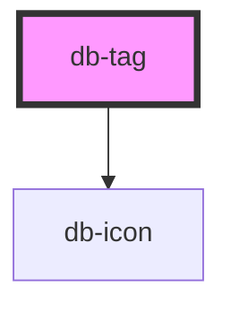

# db-tag

<!-- Auto Generated Below -->

## Properties

| Property    | Attribute   | Description                                                    | Type                                                                                                                                                                                                                                                                                                                      | Default     |
| ----------- | ----------- | -------------------------------------------------------------- | ------------------------------------------------------------------------------------------------------------------------------------------------------------------------------------------------------------------------------------------------------------------------------------------------------------------------- | ----------- |
| `icon`      | `icon`      | Attribute to add icon before tag.                              | `string`                                                                                                                                                                                                                                                                                                                  | `undefined` |
| `iconafter` | `iconafter` | Attribute to add icon after tag.                               | `string`                                                                                                                                                                                                                                                                                                                  | `undefined` |
| `small`     | `small`     | Attribute for changing the size of the tag.                    | `boolean`                                                                                                                                                                                                                                                                                                                 | `undefined` |
| `variant`   | `variant`   | Predefined variants to change background color and font color. | `"error" \| "informative" \| "light" \| "poi-db-services-einrichtung" \| "poi-dienstleistungen" \| "poi-einkaufen" \| "poi-essen-trinken" \| "poi-freizeit" \| "poi-gesundheit" \| "poi-kunst-kultur" \| "poi-wegeleitung" \| "poi-wissenswertes" \| "poi-zivile-rel-einrichtungen" \| "success" \| "track" \| "warning"` | `undefined` |

## Dependencies

### Depends on

- [db-icon](../db-icon)

### Graph

----------------------------------------------

*Built with [StencilJS](https://stenciljs.com/)*
