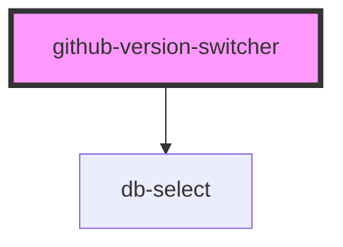

# github-version-switcher

{/* Auto Generated Below */}

## Properties

| Property | Attribute | Description                    | Type     | Default     |
| -------- | --------- | ------------------------------ | -------- | ----------- |
| `owner`  | `owner`   | Provides the owner of the repo | `string` | `undefined` |
| `repo`   | `repo`    | Provides the name of the repo  | `string` | `undefined` |

## Dependencies

### Depends on

- [db-select](../../db-select)

### Graph

----------------------------------------------

*Built with [StencilJS](https://stenciljs.com/)*
